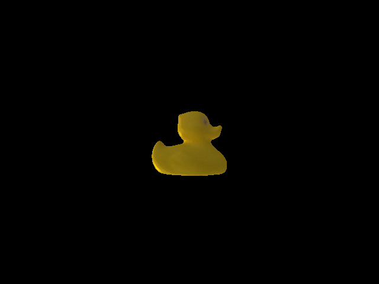
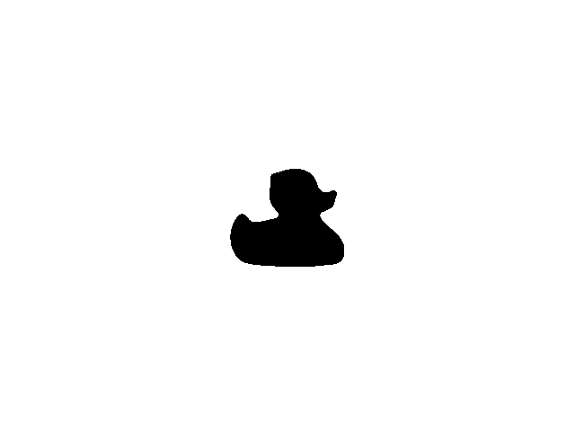
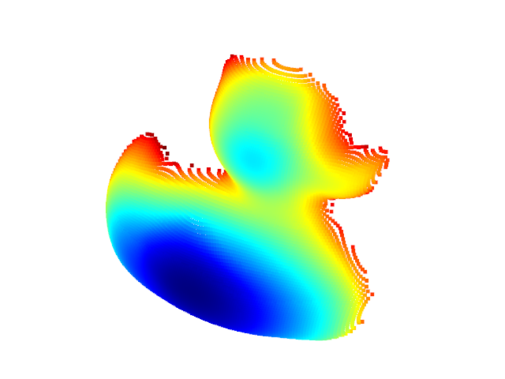

# BulletRenderer
This repository provides an environment for rendering images via pybullet.

## Installation
```shell
apt-get install meshlab
pip3 install -r requirement.txt 
```

## Demo
if you want to run [render_mesh.py](render_mesh.py) succussfully, you mush change the object mesh path.
```shell
# CUDA ID of GPU if you want to use gpu_renderer interface
export CUDA_VISIBLE_DEVICES=0
python -m render_demo.py
```

- [render_mesh.py](render_mesh.py) will create an intermediate URDF file in the [cache](./cache/) folder. 
- You can also create the URDF file by learning the [urdf_demo.py](urdf_demo.py).
- If you have the URDF, you can directly run [render_urdf.py](render_urdf.py) after change the path of URDF.

Rgb             |  Mask                      |  pointcloud
:-------------------------:|:-------------------------:|:-------------------------:
  |    |  

This project is separate from the original [RoboPose](https://github.com/ylabbe/robopose) codebase.
